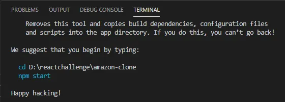
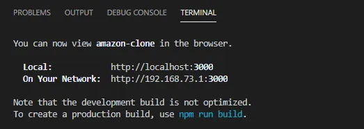
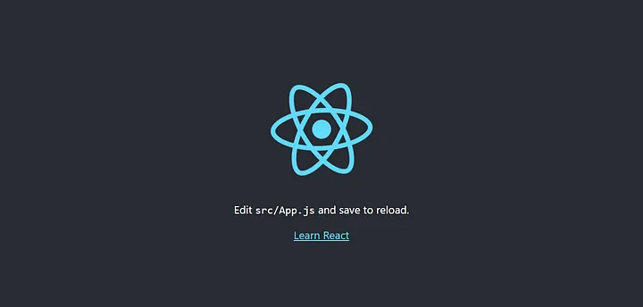
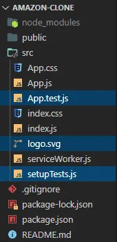
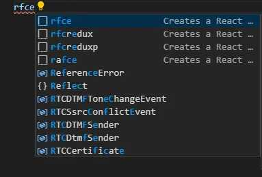
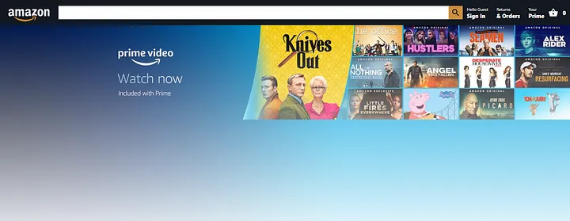
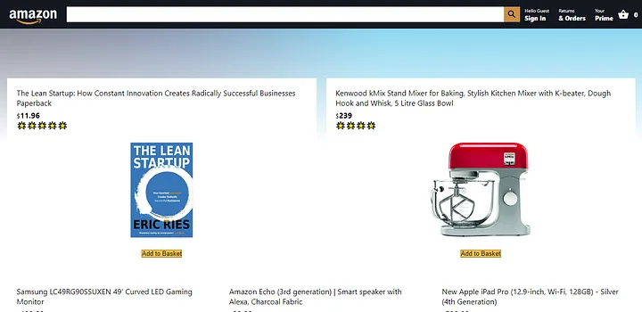
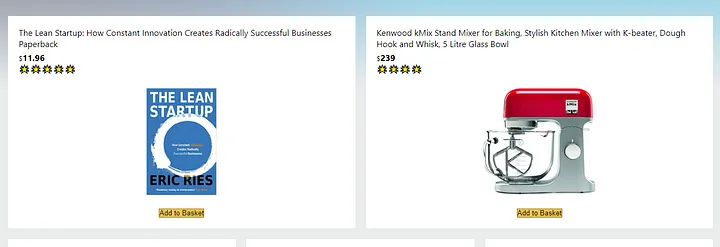
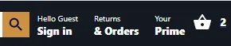

# Amazon Clone using ReactJS — The Ultimate Guide

# LET’S GOOOOO 🔥 🚀

```
npx create-react-app
```

### You know that it is finished when you see “Happy Hacking” on your terminal. If you see this, we are ready to move on.

<br>

<p align="center">
  
</p>

## Now that we have our React App installed, now we can start it. In the terminal type the following command. This command will start the React App.

```
npm start
```
### After you hit Enter, you should see your default browser open. Although I suggest Google Chrome because of it’s development tools making life easier, it’s still your personal preference, but we cannot guarantee development quality with other browsers.

<br>

<p align="center">
  
</p>

### If you did everything correct, you must see the following screen on your browser window.

<p align="center">
  
</p>

## we need to clean up our React project a bit so that we can get started with the Amazon clone.

<p align="center">
  
</p>

## Delete (optional) three files from the src folder from the React App. Those three files are

* App.test.js
* logo.svg
* setupTests.js

### We are deleting these files because these are not relevant to us in any project.

# 1. Setting up the React Router

### Open your terminal and enter the following command to install react-router-dom

```
npm install react-router-dom
```

### Let’s go in Home.js. Just type in “rfce” and you should get an option to autocomplete the snippets as shown in following picture.

<p align="center">
  
</p>

### Hit Enter while on “rfce”. This will autocomplete the React boiler plate for you.

#### Let’s just add some text there for now, let’s say Hello. The code on the Home.js file now should be.

```javascript
import React from "react";
function Home() {
   return <div className="home">Hello</div>;
}
export default Home;
```

## If you see the browser, you will not see anything because we haven’t prepared our entry point App.js yet. So let’s open the file and start setting up the React Router. First of all, we need to import the dependencies. Import them using the following code at the top of App.js

```javascript
import { BrowserRouter as Router, Route, Switch } from "react-router-dom";
```

### Once you’ve done importing the code, you can now use React Router in your file. Now that we have imported React Router, let’s configure React Router according to our needs. Use the below code in your App.js.

```javascript
import React from "react";
import "./App.css";
import { BrowserRouter as Router, Route, Switch } from "react-router-dom";
import Home from "./Home";
function App() {
return (
  <div className="app">
    <Router>
      <Switch>
        <Route path="/">
          <Home />
        </Route>
      </Switch>
    </Router>
  </div>
);
}
export default App;
```

## Now you can see Hello on the screen. Don’t worry, we are now running over the code to see what we have done.

* Our motive is to have Home component to be rendered on the default route that is “/”.
* To use the Home component, we need to import it, so we imported it at the top.

* We need to wrap the entire app into the Router component, so that every component is a part of Router and has access to the Router.

* The switch specifies that the components beneath it are to be rendered only under certain routes. So if a route is meant for “/”, you cannot see the information on “/hello” route.

* The Route component is used under the Switch component. The Route component specifies the rules of the Routes and components to render at specific route. For example in this case we have the Home component render at “/” route. We will be adding more routes to this.

## We now have the Router set up. Let’s go ahead and make the Amazon Navbar.

# 2. Creating the Navbar

### We are going to use a package for icons, and we need Material Icons to use them. So open your terminal and write the following command.

```
npm install @material-ui/core @material-ui/icons
```
### Now let’s make a new component called Header.js and let’s make a new file and call it Header.css just as we did with the home component. In each component, we will follow the same steps

#### We have to initialize the component boiler plate using “rfce” and follow the BEM convention and include the CSS file and update the class names.

#### We have the component ready. Before we actually start designing it, we need to include it in Router so that we can actually display it. In App.js where you mentioned Route for “/” route, let’s include the Header component in it too. Your updated route should look like this

```javascript
<Route path="/">
  <Header />
  <Home />
</Route>
```

## Remember you place Navbar before the Home component, because the Amazon Navbar is always at the top.

### Now finally let’s get back to Header.js and start setting up the layout of our classic Amazon Navbar. The code in your Header.js should look like this. We would go through the entire code after the code block.

<br>

```javascript
import React from "react";
import "./Header.css";
import SearchIcon from "@material-ui/icons/Search";
import ShoppingBasketIcon from "@material-ui/icons/ShoppingBasket";

function Header() {  
  return (
    <div className="header">
      
        
      

      <div className="header__search">
        <input className="header__searchInput" type="text" />
        <SearchIcon className="header__searchIcon" />
      </div>

      <div className="header__nav">
        
          <div className="header__option">
            <span className="header__optionLineOne">Hello Guest</span>
            <span className="header__optionLineTwo">Sign In</span>
          </div>
        

        
          <div className="header__option">
            <span className="header__optionLineOne">Returns</span>
            <span className="header__optionLineTwo">& Orders</span>
          </div>
        
        

        <div className="header__option">
          <span className="header__optionLineOne">Your</span>
          <span className="header__optionLineTwo">Prime</span>
        </div>

        
          <div className="header__optionBasket">
            <ShoppingBasketIcon />
            <span className="header__optionLineTwo header__basketCount">
              0
            </span>
          </div>
        
      </div>
    </div>
  );
}

export default Header;
```

<br>

## Before moving on to tearing this apart on what’s exactly going on, let’s just also grab the Header.css file so that the styling part is done.

<br> 

```css
.header {
  height: 60px;
  display: flex;
  align-items: center;
  background-color: #131921;
  position: sticky;
  top: 0;
  z-index: 100;
}

.header__logo {
  width: 100px;
  object-fit: contain;
  margin: 0 20px;
  margin-top: 18px;
}

.header__search {
  display: flex;
  flex: 1;
  align-items: center;
  border-radius: 24px;
}

.header__searchInput {
  height: 12px;
  padding: 10px;
  border: none;
  width: 100%;
}

.header__searchIcon {
  padding: 5px;
  height: 22px !important;
  background-color: #cd9042;
}

.header__optionLineOne {
  font-size: 10px;
}

.header__optionLineTwo {
  font-size: 13px;
  font-weight: 800;
}

.header__optionBasket {
  display: flex;
  align-items: center;
  color: white;
}

.header__basketCount {
  margin-left: 10px;
  margin-right: 10px;
}

.header__nav {
  display: flex;
  justify-content: space-evenly;
}

.header__option {
  display: flex;
  flex-direction: column;
  margin-left: 10px;
  margin-right: 10px;
  color: white;
}
```

### Now the time to tear apart what we are exactly doing in the above two gigantic pieces of code

* We made a Navbar for Amazon Clone. In the first code block we laid out the layout. It’s just like basic HTML but in React we call it JSX. 

* We set up that we want the Amazon logo at the left, the search bar at the center, and the other options at right which we then make happen with our CSS files

* We have used Material UI icons in the Navbar too, like the Search Icon and the Basket icons, they were imported from the Material UI Icons package.

* In the CSS, we basically set the display property of the Navbar to flex so that the items align next to each other, we changed the background colors, we tweaked the search box and then we styled the options.

### Once you’ve done this, you will see a Navbar like this

<p align="center">
  
</p>

# 3. Creating the Amazon Homepage

### As of now, we have the Navbar design ready and it is same as Amazon! Let’s now work on the actual homepage of Amazon. This is going to be interesting. We are going to work with two components in this section. So without wasting any time, let’s go right into it!

### We already made the Home component which is rendered by default because we configured it to be rendered it on default route “/” in the React Router. Now let’s go and do something creative in the Home component.

### Open your Home.js and let’s start laying out our layout! We will start with the image which Amazon shows at the top of its landing page.

```javascript
import React from "react";
import "./Home.css";

function Home() {
  return (
    <div className="home">
      <div className="home__container">
        
      </div>
    </div>
    );
};

export default Home;
```

### Now let’s style this! Open your Home.css and let’s start styling our Amazon Homepage!

```css
.home {
  display: flex;
  justify-content: center;
  margin-left: auto;
  margin-right: auto;
  max-width: 1500px;
}
.home__image {
  width: 100%;
  z-index: -1;
  margin-bottom: -150px;
  mask-image: linear-gradient(to bottom, rgba(0, 0, 0, 1), rgba(0, 0, 0, 0));
}
```

## Once you hit save, you should see the following.

<p align="center">
  
</p>

## Let’s add some dummy products to the Homepage to make it more attractive! We will work on the functionality in the later sections.

## To display products, we will create a new component name Product. You know the drill, you need to create both the JS and CSS files, you need to follow the BEM convention and update the class name of the component. When you’re all set up, let’s create a layout of the Product component!

```javascript
import React from "react";
import "./Product.css";

function Product({ id, title, image, price, rating }) {
 
  return (
    <div className="product">
      <div className="product__info">
        <p>{title}</p>
        <p className="product__price">
          <small>$</small>
          <strong>{price}</strong>
        </p>
        <div className="product__rating">
          {Array(rating)
            .fill()
            .map((_, i) => (
              <p>🌟</p>
            ))}
        </div>
      </div>

      

      <button>Add to Basket</button>
    </div>
  );
}

export default Product;
```

### Before diving into the code, let’s get the CSS too! Open Product.css and have this CSS in there.

```css
.product {
  display: flex;
  flex-direction: column;
  align-items: center;
  justify-content: flex-end;
  margin: 10px;
  padding: 20px;
  width: 100%;
  max-height: 400px;
  min-width: 100px;
  background-color: white;
  z-index: 1;
}

.product__rating {
  display: flex;
}

.product > img {
  max-height: 200px;
  width: 100%;
  object-fit: contain;
  margin-bottom: 15px;
}

.product > button {
  background: #f0c14b;
  border: 1px solid;
  margin-top: 10px;
  border-color: #a88734 #9c7e31 #846a29;
  color: #111;
}

.product__price {
  margin-top: 5px;
}

.product__info {
  height: 100px;
  margin-bottom: 15px;
}
```

### So this one is a little hard to understand at the first place, so let’s tear through the code and see exactly what’s happening.

* We are passing some props through the component, which can be used by the components to render. These props are — Product ID, Title, Price, Image, Ratings.

* These props are usually variables and objects that are passed by parent components. We can render props on the screen in this case because all of the props here are viewable. So, we render the data on the screen by enclosing the variables with {} at appropriate places.

* To render the ratings, we use a bit different way here. We create an array of length of the ratings passed and loop through them and render out the star emoji the number of times the ratings passed through the props.

### You cannot see the products on the screen yet! You need to place the products on the Homepage of the Amazon Clone, so let’s go back to Home.js and add some code! Your Home.js should look like this

<br>

```javascript
import React from "react";
import "./Home.css";
import Product from "./Product";

function Home() {
  return (
    <div className="home">
      <div className="home__container">
        

        <div className="home__row">
          <Product
            id="12321341"
            title="The Lean Startup: How Constant Innovation Creates Radically Successful Businesses Paperback"
            price={11.96}
            rating={5}
            image="https://images-na.ssl-images-amazon.com/images/I/51Zymoq7UnL._SX325_BO1,204,203,200_.jpg"
          />
          <Product
            id="49538094"
            title="Kenwood kMix Stand Mixer for Baking, Stylish Kitchen Mixer with K-beater, Dough Hook and Whisk, 5 Litre Glass Bowl"
            price={239.0}
            rating={4}
            image="https://images-na.ssl-images-amazon.com/images/I/81O%2BGNdkzKL._AC_SX450_.jpg"
          />
        </div>

        <div className="home__row">
          <Product
            id="4903850"
            title="Samsung LC49RG90SSUXEN 49' Curved LED Gaming Monitor"
            price={199.99}
            rating={3}
            image="https://images-na.ssl-images-amazon.com/images/I/71Swqqe7XAL._AC_SX466_.jpg"
          />
          <Product
            id="23445930"
            title="Amazon Echo (3rd generation) | Smart speaker with Alexa, Charcoal Fabric"
            price={98.99}
            rating={5}
            image="https://media.very.co.uk/i/very/P6LTG_SQ1_0000000071_CHARCOAL_SLf?$300x400_retinamobilex2$"
          />
          <Product
            id="3254354345"
            title="New Apple iPad Pro (12.9-inch, Wi-Fi, 128GB) - Silver (4th Generation)"
            price={598.99}
            rating={4}
            image="https://images-na.ssl-images-amazon.com/images/I/816ctt5WV5L._AC_SX385_.jpg"
          />
        </div>

        <div className="home__row">
          <Product
            id="90829332"
            title="Samsung LC49RG90SSUXEN 49' Curved LED Gaming Monitor - Super Ultra Wide Dual WQHD 5120 x 1440"
            price={1094.98}
            rating={4}
            image="https://images-na.ssl-images-amazon.com/images/I/6125mFrzr6L._AC_SX355_.jpg"
          />
        </div>
      </div>
    </div>
  );
}

export default Home;
```

### Go to your Home.css and add styles for the missing class!

```css
.home__row {  
  display: flex; 
  z-index: 1; 
  margin-left: 5px;  
  margin-right: 5px;
}
```

## After adding this, we have a better output. It should be looking like this!

<p align="center">
  
</p>

## But there’s still something to be taken care of! The white spaces between the Products! Let’s go ahead and fix them! Let’s go to index.css and change the background color of the app! Your index.css should look like this.

```css
* {
  margin: 0;
}

body {
  background-color: rgb(234, 237, 237);
  margin: 0;
  font-family: -apple-system, BlinkMacSystemFont, "Segoe UI", "Roboto", "Oxygen",
    "Ubuntu", "Cantarell", "Fira Sans", "Droid Sans", "Helvetica Neue",
    sans-serif;
  -webkit-font-smoothing: antialiased;
  -moz-osx-font-smoothing: grayscale;
}

code {
  font-family: source-code-pro, Menlo, Monaco, Consolas, "Courier New",
    monospace;
}
```

### Now, if you save and return the browser, you should see the white space has been disappeared because we just changed the background color!

<p align="center">
  
</p>

### Now that our Homepage is working, now we can move over to some interesting stuff, the 
<span style="color:red">***React Context API***</span>. It is a <span style="color:red">***Application Level State Management***</span> so that you can access important data from any component when necessary.

# 4. Setting up React Context API

## The Context API is a very important part of React. It helps us to make application level states and we can get the data from those states through any component. There are many alternatives, one of them is Redux. But I highly recommend you should start off with React Context API.

## Setting up React Context API is more of a boiler plate. Things won’t make sense at first but once you practice, things will automatically start making sense.

### So let’s make a file named StateProvider.js and have these contents

<br>

```javascript
import React, { createContext, useContext, useReducer } from "react";

// Prepares the dataLayer
export const StateContext = createContext();

// Wrap our app and provide the Data layer
export const StateProvider = ({ reducer, initialState, children }) => (
  <StateContext.Provider value={useReducer(reducer, initialState)}>
    {children}
  </StateContext.Provider>
);

// Pull information from the data layer
export const useStateValue = () => useContext(StateContext);
```

### Now let’s make a file name reducer.js here’s where you will define all of your application level states and define actions to make changes to the state.

```javascript
export const initialState = {
  basket: [],
  user: null
};

// Selector
export const getBasketTotal = (basket) => 
  basket?.reduce((amount, item) => item.price + amount, 0);

const reducer = (state, action) => {
  console.log(action);
  switch (action.type) {
    default:
      return state;
  }
};

export default reducer;
```

## Let’s see what’s happening in this piece of code.

* The reducer is a place where you declare all the application level states which can be used later by the application.

* In initialState, we declare the states we are going to use. In this case, basket and user. We would cover them in future sections.

* The actual reducer function takes in a state and action. The state and action is provided so that the reducer can perform operations on the state.
We export the reducer.

## We haven’t done yet! We need to use this reducer to manage our application level state. To do so, let’s introduce everything in the index.js. After the modifications, your index.js should look like this.

```javascript
import React from "react";
import ReactDOM from "react-dom";
import "./index.css";
import App from "./App";
import * as serviceWorker from "./serviceWorker";
import reducer, { initialState } from "./reducer";
import { StateProvider } from "./StateProvider";

ReactDOM.render(
  <React.StrictMode>
    <StateProvider initialState={initialState} reducer={reducer}>
      <App />
    </StateProvider>
  </React.StrictMode>,
  document.getElementById("root")
);

// If you want your app to work offline and load faster, you can change
// unregister() to register() below. Note this comes with some pitfalls.
// Learn more about service workers: https://bit.ly/CRA-PWA
serviceWorker.unregister();
```

## So let’s see what happens here.

* We import few things — reducer and initialState from reducer.js and then we import the StateProvider component from the StateProvider.js.

* We enclose the App component with StateProvider so that children get access to the states too.

* We pass in the reducer and initialState to the StateProvider.

* Now the State knows what is the initial state and which reducer too.

### from next section, we are actually going to use it so that we can store the basket and user information in it so that any component can access the information.

# 5. Adding the Basket functionality

### Now that we have the React Context API along with the reducer set up, now we can add the Add to Basket functionality!

### So basically, we need to import the state whenever we feel the need and we can dispatch events. We will go in depth about that in this section.

### To start with things, let’s go to our Product.js and add the Add to Basket functionality.

### First of all, we import the state and dispatch using useStateValue() hook and then it’s all easy to work with stuff, so let’s import it. Add this to the top of Product.js

```
import { useStateValue } from "./StateProvider";
```

### Well done! Now you can use the hook! So go beneath the Product component itself and add this code.

```
const [{ basket }, dispatch] = useStateValue();
```

### So this means two things, we are using the useStateValue hook to

* Bring in a state named basket

* And we are also getting the dispatch function which allows us to dispatch actions to change the state in the reducer.

### Now that we have everything we require to add item to basket, let’s actually perform the code to add the item to basket.

## Your updated Product.js should look like this

```javascript
import React from "react";
import "./Product.css";
import { useStateValue } from "./StateProvider";

function Product({ id, title, image, price, rating }) {
  const [{ basket }, dispatch] = useStateValue();

  const addToBasket = () => {
    // dispatch the item into the data layer
    dispatch({
      type: "ADD_TO_BASKET",
      item: {
        id: id,
        title: title,
        image: image,
        price: price,
        rating: rating,
      },
    });
  };

  return (
    <div className="product">
      <div className="product__info">
        <p>{title}</p>
        <p className="product__price">
          <small>$</small>
          <strong>{price}</strong>
        </p>
        <div className="product__rating">
          {Array(rating)
            .fill()
            .map((_, i) => (
              <p>🌟</p>
            ))}
        </div>
      </div>

      

      <button onClick={addToBasket}>Add to Basket</button>
    </div>
  );
}

export default Product;
```

### Let’s see what we’ve changed here.

* First of all, we set an onClick on the button. Once the button is clicked, addToBasket function will fire off.

* The addToBasket function fires off the dispatch to the reducer instructing to update the state with the provided data. Here the type is “ADD_TO_BASKET” which we will define in the reducer in a bit. We are dispatching the action along with its data.

## Now let’s go to the reducer and define the action and define what it exactly does. Your reducer.js should look like this, we will run through the code after the code block.

```javascript
export const initialState = {
  basket: [],
  user: null
};

// Selector
export const getBasketTotal = (basket) => 
  basket?.reduce((amount, item) => item.price + amount, 0);

const reducer = (state, action) => {
  console.log(action);
  switch (action.type) {
    case "ADD_TO_BASKET":
      return {
        ...state,
        basket: [...state.basket, action.item],
      };
    default:
      return state;
  }
};

export default reducer;
```

### Okay so let’s see what’s happening here.

* We are adding an action type to the switch case, we call it “ADD_TO_BASKET”

* We set the state, we update the basket, but here we use the spread operator (…) so that previous state is not lost. And that’s how we add items to the basket array in our state in reducer.

* Now let’s update the Navbar to show the number of items currently present in the basket. So let’s go to Header.js and start coding!

### We replace the hardcoded 0 in the basket part of the Header component, and now your code should look like this.

```javascript
import React from "react";
import "./Header.css";
import SearchIcon from "@material-ui/icons/Search";
import ShoppingBasketIcon from "@material-ui/icons/ShoppingBasket";
import { Link } from "react-router-dom";
import { useStateValue } from "./StateProvider";

function Header() {
  const [{ basket, user }, dispatch] = useStateValue();

  return (
    <div className="header">
      <Link to="/">
        
      </Link>

      <div className="header__search">
        <input className="header__searchInput" type="text" />
        <SearchIcon className="header__searchIcon" />
      </div>

      <div className="header__nav">
        
          <div className="header__option">
            <span className="header__optionLineOne">Hello Guest</span>
            <span className="header__optionLineTwo">Sign in</span>
          </div>
        

        
          <div className="header__option">
            <span className="header__optionLineOne">Returns</span>
            <span className="header__optionLineTwo">& Orders</span>
          </div>
        
        

        <div className="header__option">
          <span className="header__optionLineOne">Your</span>
          <span className="header__optionLineTwo">Prime</span>
        </div>

        <Link to="/checkout">
          <div className="header__optionBasket">
            <ShoppingBasketIcon />
            <span className="header__optionLineTwo header__basketCount">
              {basket?.length}
            </span>
          </div>
        </Link>
      </div>
    </div>
  );
}

export default Header;
```

### Let’s list out what new we have introduced in the above piece of code.

* We have brought in the states, and the dispatch functions so that we can dispatch actions to the reducer.

* We removed the hardcoded 0 from the basket and added basket?.length , which will give the number of items in the basket array.

* We set up the links for checkout and home. This is because we will need them in the next section itself! Link component comes with react-router-dom so that we can link to routes without reloading pages! Interesting!

## After this, if you add items to the basket, you should see your basket updating like this.

<br>

<p align="center">
  
</p>

## Now that we have basket ready, now let’s get our hands dirty with Firebase and set up authentication and database! We will learn that in the next section in this article.

# 6. Setting up Firebase

## Now, install dependencies named firebase and firebase-tools

```
npm install -g firebase-tools && npm install firebase && firebase login
```

### This will install both the dependencies for you. Also it will ask you to log into your Google Account so that you can use Firebase tools. In the mean time let’s go to Firebase, and select the config option.

* Copy the entire config and then go back to Visual Studio Code, make a new file named firebase.js and paste it.

* Let’s make the use of the firebase package we just installed through npm and let’s edit the firebase.js file so that we can use authentication and the database from your project.

```javascript
import firebase from "firebase";

const firebaseConfig = {
  apiKey: "USE_YOUR_OWN",
  authDomain: "USE_YOUR_OWN",
  databaseURL: "USE_YOUR_OWN",
  projectId: "USE_YOUR_OWN",
  storageBucket: "USE_YOUR_OWN",
  messagingSenderId: "USE_YOUR_OWN",
  appId: "USE_YOUR_OWN",
  measurementId: "USE_YOUR_OWN",
};

const firebaseApp = firebase.initializeApp(firebaseConfig);

const db = firebaseApp.firestore();
const auth = firebase.auth();

export { db, auth };
```

# 7. Setting up Authentication

